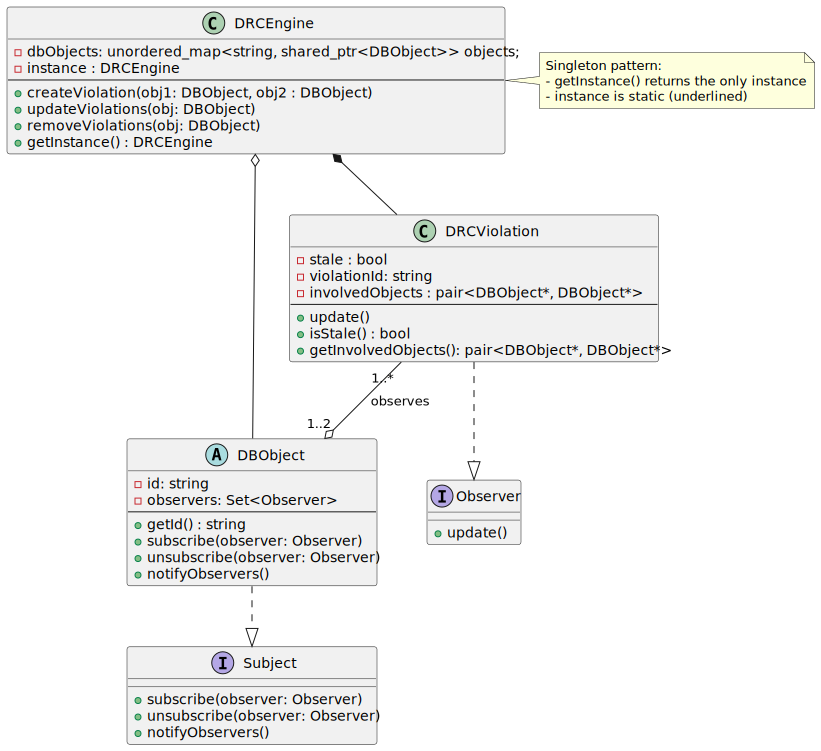

# Digital Rule Checker System 

This is solves the interesting problem of Digital Rule Checking using the Observer and Singleton patterns.  

## Problem Statement
Digital Rule Checking involves verifying components in an electronic board (Pins, Vias and Wires). There are rules affecting each component, for example - the minimum distance between each pin or a via and a wire. 

A DRC System must track DRC violations. When an object is removed, it's corresponding DRC violations must be removed. Also, when an object is updated, it's corresponding DRCs must be updated. 

## How to run? 

    mkdir build
    cd build 
    cmake ..
    cmake --build .
    
    # To run tests
    ctest

## Design diagram
